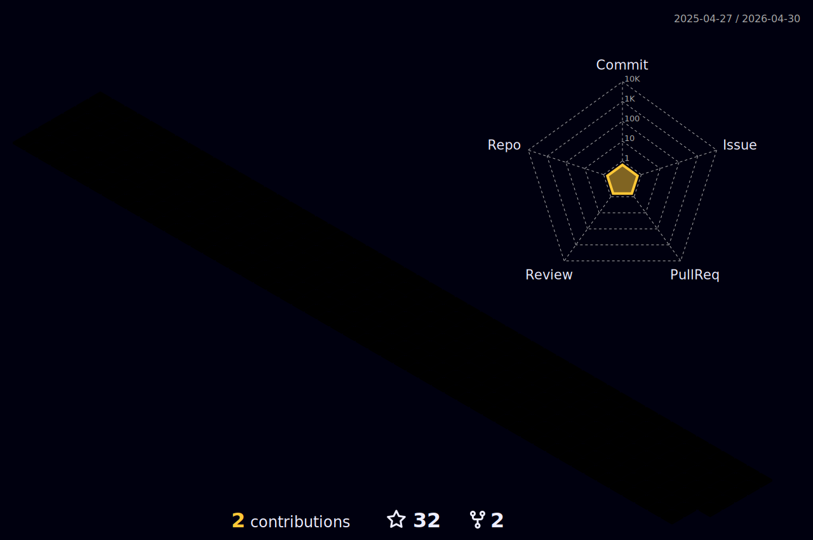

<h1 align="center">
  
</h1>

### 🚚 What I Deliver:

- Gas-efficient, low-latency Solana programs.

- Custom dApps (DeFi, NFT marketplaces, DAOs).

- Cross-chain interoperability solutions.

- Security audits and vulnerability fixes.

### ⚙ Core skills:

- Solana Development: Programs (Smart Contracts), PDAs, Token Extensions, and on-chain data storage.

- Rust: Deep expertise in writing optimized secure Solana programs and, frontend and backend app using Rust.

- Anchor Framework: Proficient in Anchor for streamlined Solana developement.

- Full-Stack dApps: Frontend (React/Next.js) + backend (Node.js, PostgreSQL) integration.

### 🛠 Tech skills:

  

### 📞 Connect with me:

  <a href="https://www.linkedin.com/in/stanislav-kuhar-8bb413352">
   Stanislav Kuhar
</a>

<a href="https://t.me/Stasik729">
   @Stasik729
</a>

<a href="https://wa.me/380660841904">
   +380 660841904
</a>

  

<h2>🏆 GitHub Trophies</h2>

  

