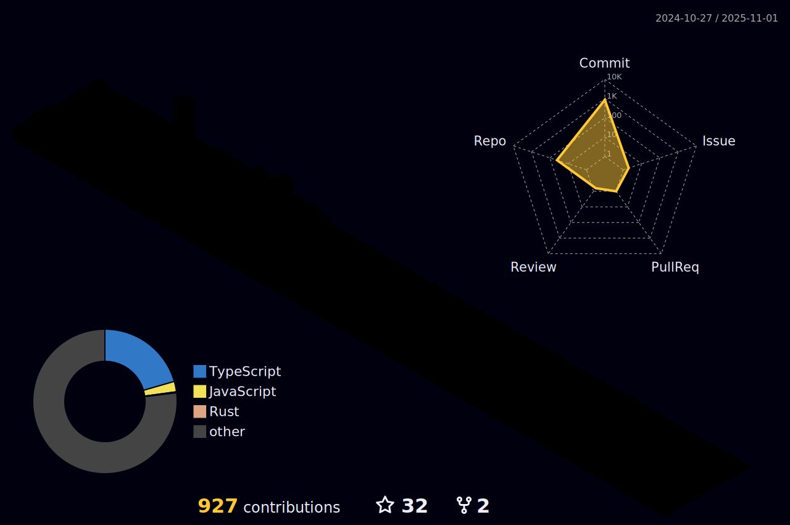

  

    
  

  

    

      <h2>🚚 What I Deliver</h2>
      <ul>
        <li>Gas-efficient, low-latency Solana programs.</li>
        <li>Custom dApps (DeFi, NFT marketplaces, DAOs).</li>
        <li>Cross-chain interoperability solutions.</li>
        <li>Security audits and vulnerability fixes.</li>
      </ul>
    

  

  

    

      <h2>⚙ Core skills</h2>
      <ul>
        <li>Solana Development: Programs (Smart Contracts), PDAs, Token Extensions, and on-chain data storage.</li>
        <li>Rust: Deep expertise in writing optimized secure Solana programs and, frontend and backend app using Rust.
        </li>
        <li>Anchor Framework: Proficient in Anchor for streamlined Solana developement.</li>
        <li>Web3 Integration: Solana CLI, SPL Tokens, Metaplex, and wallets (Phantom, Solflare).</li>
        <li>Full-Stack dApps: Frontend (React/Next.js) + backend (Node.js, PostgreSQL) integration.</li>
    

  

  

    
  

  <h2>📞 Connect with me</h2>

  

     Stanislav Kuhar
     +380 660841904
     @Stasik729
  

  <h2>👁 Frontend Technologies</h2>

  <ul>
    <li style="display: flex; align-items: center; justify-content: start;">
      Core:
      

        
        
        
        
        
        
      

    </li>
    <li style="display: flex; align-items: center; justify-content: start;">
      JavaScript Ecosystem:
      

        
        
        
      

    </li>
    <li style="display: flex; align-items: center; justify-content: start;">
      Frameworks:
      

        
        
        
        
      

    </li>
    <li style="display: flex; align-items: center; justify-content: start;">
      UI Libraries:
      

        
      

    </li>
  </ul>

  <h2>🚨 Backend Technologies</h2>

  <ul>
    <li style="display: flex; align-items: center; justify-content: start;">
      JavaScript Runtime:
      

        
      

    </li>
    <li style="display: flex; align-items: center; justify-content: start;">
      API:
      

        
        
      

    </li>
    <li style="display: flex; align-items: center; justify-content: start;">
      Frameworks:
      

        
        
      

    </li>
    <li style="display: flex; align-items: center; justify-content: start;">
      Python Stack:
      

        
        
      

    </li>
    <li style="display: flex; align-items: center; justify-content: start;">
      PHP Stack:
      

        
        
      

    </li>
    <li style="display: flex; align-items: center; justify-content: start;">
      Rust Stack:
      

        
        
        
      

    </li>
    <li style="display: flex; align-items: center; justify-content: start;">
      System:
      

        
        
      

    </li>
  </ul>

  <h2>📃 Data Layer</h2>

  <ul>
    <li style="display: flex; align-items: center; justify-content: start;">
      SQL:
      

        
        
      

    </li>
    <li style="display: flex; align-items: center; justify-content: start;">
      NoSQL:
      

        
      

    </li>
    <li style="display: flex; align-items: center; justify-content: start;">
      Caching:
      

        
      

    </li>
    <li style="display: flex; align-items: center; justify-content: start;">
      BaaS:
      

        
        
      

    </li>
  </ul>

  <h2>🛠 Developer Tools & Testing</h2>

  <ul>
    <li style="display: flex; align-items: center; justify-content: start;">
      Version Control:
      

        
      

    </li>
    <li style="display: flex; align-items: center; justify-content: start;">
      Code Quality:
      

        
      

    </li>
    <li style="display: flex; align-items: center; justify-content: start;">
      Testing:
      

        
      

    </li>
    <li style="display: flex; align-items: center; justify-content: start;">
      Package Management:
      

        
        
        
      

    </li>
    <li style="display: flex; align-items: center; justify-content: start;">
      Build Tools:
      

        
        
      

    </li>
    <li style="display: flex; align-items: center; justify-content: start;">
      API Tools:
      

        
      

    </li>
    <li style="display: flex; align-items: center; justify-content: start;">
      ORM:
      

        
      

    </li>
  </ul>

  <h2>⭕ Infrastructure & DevOps</h2>

  <ul>
    <li style="display: flex; align-items: center; justify-content: start;">
      Cloud:
      

        

      

    </li>
    <li style="display: flex; align-items: center; justify-content: start;">
      Containerization:
      

        
      

    </li>
    <li style="display: flex; align-items: center; justify-content: start;">
      Web Server:
      

        
      

    </li>
    <li style="display: flex; align-items: center; justify-content: start;">
      Deployment:
      

        
      

    </li>
  </ul>

  

<h2>🏆 GitHub Trophies</h2>

  
  

