<!-- 

  

 -->

<h1 align="center" style="margin-bottom: 50px;">Solana Developer</h1>

  

    
  

  

    

      
⚙ Core skills

      <ul>
        <li>Solana Development: Programs (Smart Contracts), PDAs, Token Extensions, and on-chain data storage.</li>
        <li>Rust: Deep expertise in writing optimized secure Solana programs and, frontend and backend app using Rust.</li>
        <li>Anchor Framework: Proficient in Anchor for streamlined Solana developement.</li>
        <li>Web3 Integration: Solana CLI, SPL Tokens, Metaplex, and wallets (Phantom, Solflare).</li>
        <li>Full-Stack dApps: Frontend (React/Next.js) + backend (Node.js, PostgreSQL) integration.</li>
    

  

  

    

      
🚚 What I Deliver

      <ul>
        <li>Gas-efficient, low-latency Solana programs.</li>
        <li>Custom dApps (DeFi, NFT marketplaces, DAOs).</li>
        <li>Cross-chain interoperability solutions.</li>
        <li>Security audits and vulnerability fixes.</li>
      </ul>
    

  

  

    
  

  
  
  
  

  

<h2>🏆 GitHub Trophies</h2>

  
  

